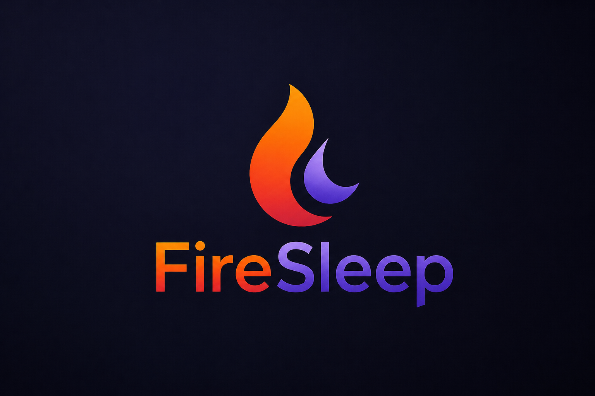
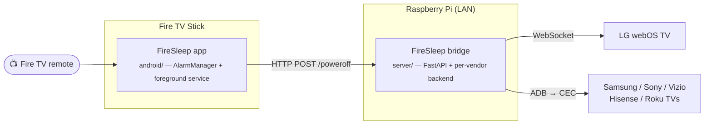

<p align="center">
  
</p>

<h1 align="center">FireSleep</h1>

<p align="center">
  <em>A real sleep timer for your TV, driven by the Fire TV remote.</em>
</p>

<p align="center">
  
  
  
  
</p>

---

Most TVs hide their sleep timer in a settings menu you can only reach with the
TV's own remote. If you watch through a Fire TV Stick, that means juggling two
remotes in the dark — and if you forget, the TV stays on all night.

FireSleep is a sideloaded Fire TV app that adds a proper sleep timer **and**
actually powers the TV off, all from the Fire TV remote you already have. No
second remote, no cloud, no account: your TV, your Pi, your LAN.

## How it works



The Fire TV app owns the timer (`AlarmManager` behind a foreground service, so
it survives backgrounding and doze). The Pi owns the TV-vendor bits (pairing,
WebSocket chatter). Adding a new TV brand is a change to `server/`, not the
app.

## Features

- ⏱ **Real sleep timer** — survives backgrounding, doze, and the screensaver.
- 🔌 **Actually powers the TV off** — not just the Fire TV.
- 🎮 **Triple-press ≡ Menu** to bring up the timer from any app (Netflix, YouTube, …).
- 📺 **Multi-TV** — fan out one power-off to every TV on your LAN.
- 🛜 **No cloud, no account, no analytics** — talks only to your Pi on `:8765`.

## Tested

- **LG webOS** (UR78 / webOS 23) — works end-to-end.
- **Samsung** — works end-to-end.
- **Fire TV Stick 4K Max** — primary dev target; should work on any Fire TV
  Stick on Fire OS 6+ (minSdk 22).
- **Fire TV Stick 1st/2nd Gen (Fire OS 5)** — app + timer + bridge work, but
  the triple-press shortcut does not (see below).

PRs welcome for Sony, Vizio, Hisense, Roku TVs — drop a sibling bridge file
next to `server/bridge.py` and document pairing in `server/README.md`.

## Quick start

```bash
# 1. Run the bridge on a Pi (or any Linux box on your LAN)
cd server && docker compose up -d --build
#    open http://<pi>:8765/ to set the TV host and pair

# 2. Build the Fire TV app
cd android && ./gradlew assembleDebug

# 3. Sideload onto the Fire TV
adb connect <FIRE_TV_IP>:5555
adb install -r app/build/outputs/apk/debug/app-debug.apk
```

On first launch the app asks for the Pi's LAN IP. That's it.

## Triple-press shortcut (optional)

FireSleep ships with an Accessibility Service that lets you bring up the timer
from any app — Netflix, YouTube, etc. — by triple-pressing the **≡ Menu**
button on the Fire TV remote.

Fire TV's Settings UI sometimes hides third-party accessibility services. If
the toggle doesn't appear under Settings → Accessibility, enable it once over
ADB:

```bash
adb shell settings put secure enabled_accessibility_services com.firesleep.app/com.firesleep.app.access.FireSleepAccessibilityService
adb shell settings put secure accessibility_enabled 1
```

### Fire OS 5 (Fire TV Stick 1st/2nd Gen) — not supported

The triple-press shortcut requires **Fire OS 6 or newer** (Fire TV Stick 4K,
4K Max, Cube, etc.). On Fire OS 5 sticks (Fire TV Stick 1st/2nd Gen, Fire TV
Stick Basic Edition) Amazon both hides the Accessibility toggle *and* actively
strips third-party entries from `enabled_accessibility_services` within
seconds of any ADB write — there's no reliable way to keep the service
bound.

The rest of the app still works on Fire OS 5: install it, pin it to the home
row, and open it from the launcher to set a timer. The bridge-driven TV
power-off works the same.

## Repo layout

```
android/   # Sideloaded Fire TV app (Kotlin, Jetpack Compose for TV)
server/    # Raspberry Pi bridge (FastAPI + per-vendor code) + web admin UI
design/    # Pixel-level design spec
```

See **[`android/README.md`](android/README.md)** for build details and
**[`server/README.md`](server/README.md)** for pairing, Docker, and systemd
setup.

## Security

- App permissions: `INTERNET` only. No storage, location, camera, or mic.
- Cleartext HTTP is allowed app-wide (Android's network-security-config can't
  restrict to a CIDR), but the app only ever talks to the one user-entered LAN
  IP on `:8765`.
- The bridge has no remote auth — it trusts whoever can reach it on the LAN.
  Don't port-forward `8765`.
- Nothing leaves your LAN. No cloud, no analytics, no phone-home.

## Contributing

Bug reports and PRs are welcome — especially new TV-vendor bridges. Open an
issue first if it's a bigger change so we can talk through the shape.

## License & disclaimer

[MIT](LICENSE). FireSleep is provided **as-is**, with no warranty and no
liability — it pokes at your TV's power state over the network, and you run
it at your own risk. Not affiliated with Amazon, LG, Samsung, or any other
vendor mentioned here; trademarks belong to their respective owners.

<p align="center"><sub>Built for people who fall asleep with the TV on.</sub></p>
